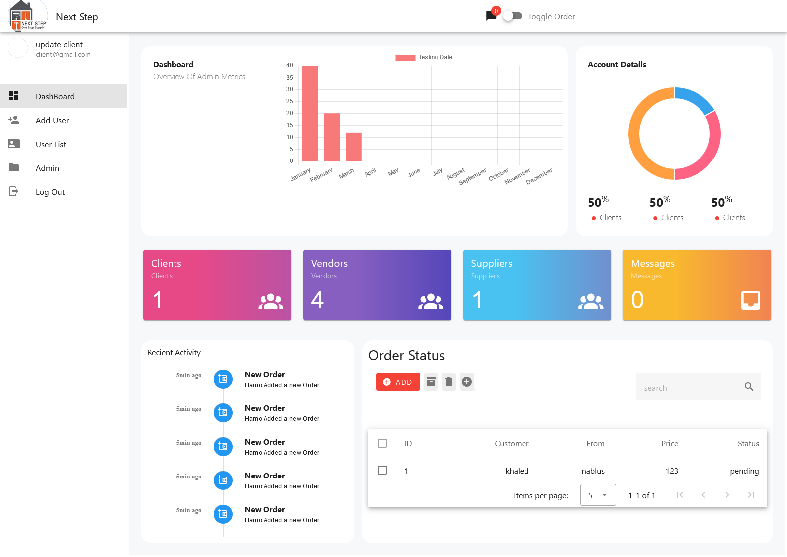
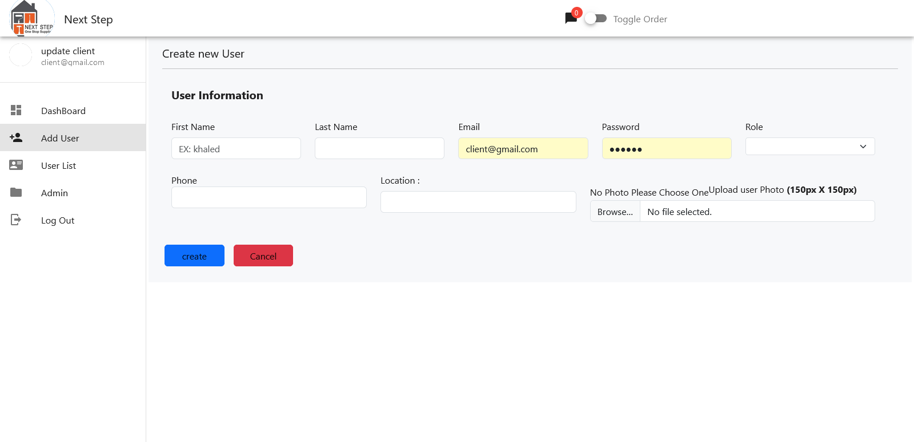
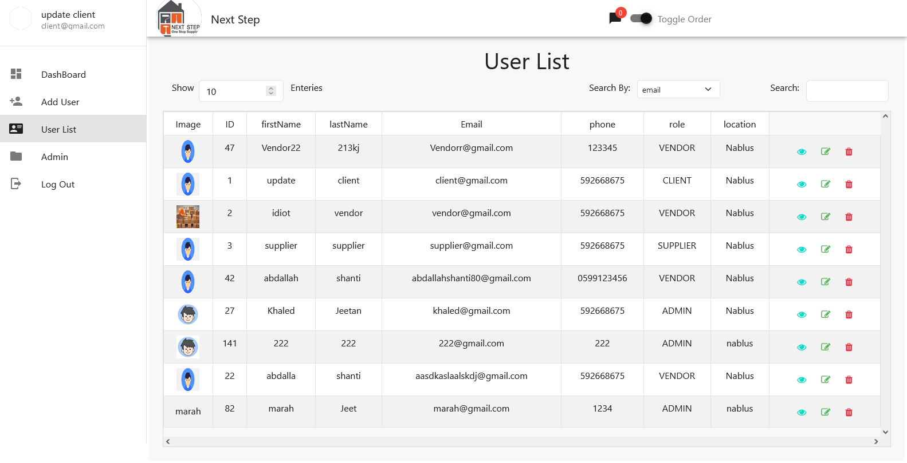
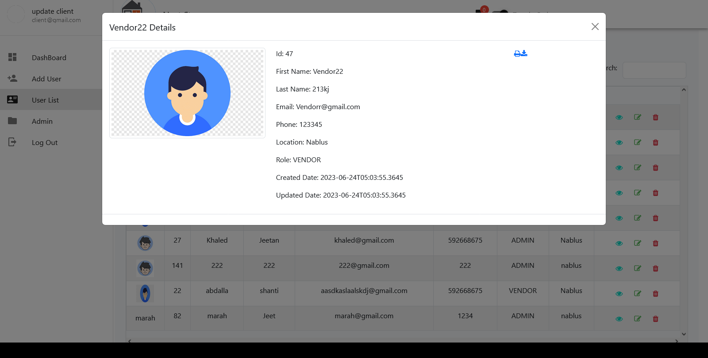
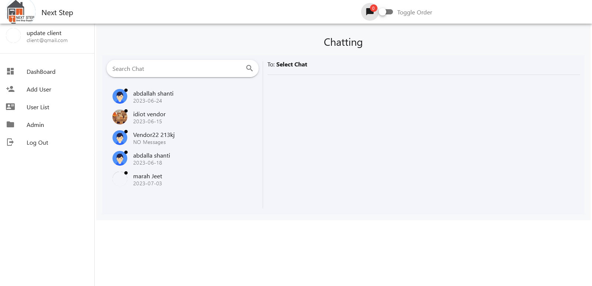

# Frontend Web Dashboard for Admin Account (Under Development)

Welcome to the Frontend Web Dashboard for the Admin Account project! This dashboard is designed to provide an intuitive user interface for managing various aspects of your application. The dashboard is developed using Vue.js 3, Vuetify, Pinia, and Vue Router for navigation. Please note that this project is still under development, and not all features are functional at this time.

## Project Overview

This frontend dashboard is part of a project that includes a backend, which has been developed separately. You can find the backend code in the [graduation-project](https://github.com/khaledJeetan/graduation-project) repository. The goal of this dashboard is to seamlessly interact with the backend services and facilitate efficient management of your application.

## Screen Shots





## Getting Started

To set up and run the project locally, follow these steps:

1. Clone this repository to your local machine:
```sh
git clone https://github.com/khaledJeetan/admin-dashboard.git
cd admin-dashboard
```

2. Install project dependencies:
```sh
npm install
```

## Recommended IDE Setup

For an optimal development experience, we recommend using the following IDE setup:

- [Visual Studio Code](https://code.visualstudio.com/)
- [Volar](https://marketplace.visualstudio.com/items?itemName=Vue.volar) (Disable Vetur)
- [TypeScript Vue Plugin (Volar)](https://marketplace.visualstudio.com/items?itemName=Vue.vscode-typescript-vue-plugin)

## Running the Development Server

To run the development server with hot-reload, use the following command:

```sh
npm run dev
```

## Building for Production

When you're ready to deploy your dashboard, you can generate a production build using the following command:

```sh
npm run build
```

## Project Status

As of now, the project is still under development. Not all features are connected to the backend, and some functionality may not be fully implemented. It's important to note that this project is being actively worked on, and new features will be committed as they are completed.

## Contributions

Contributions to this project are welcome! If you find any issues or have suggestions for improvements, feel free to open an issue or submit a pull request.

## License

This project is licensed under the [MIT License](LICENSE).

---